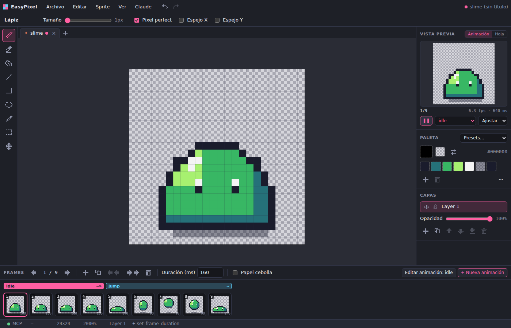
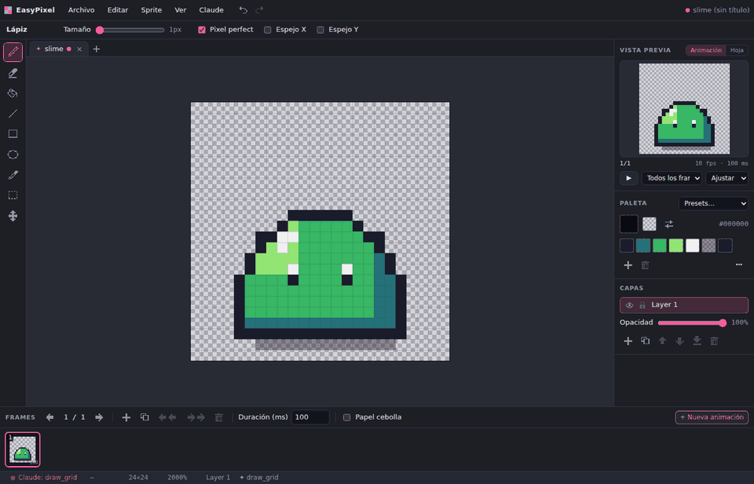
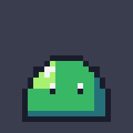
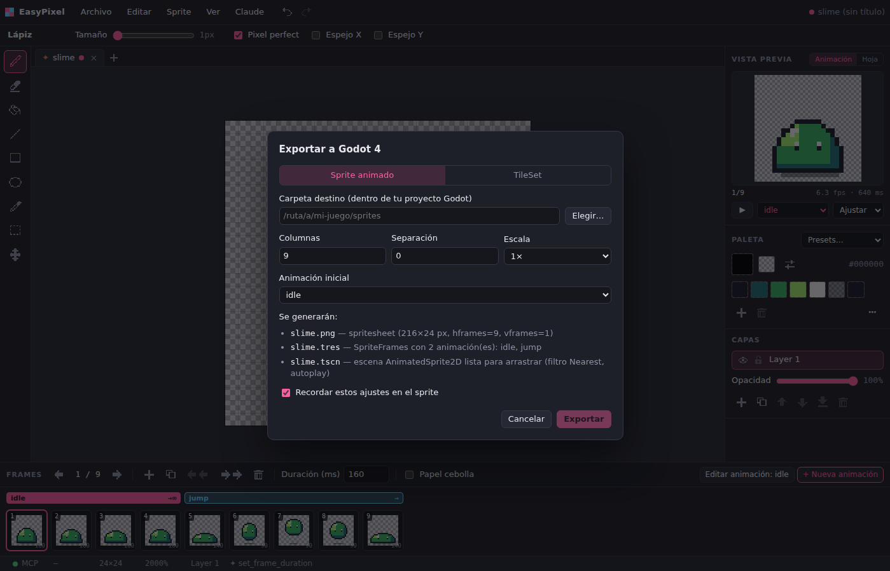
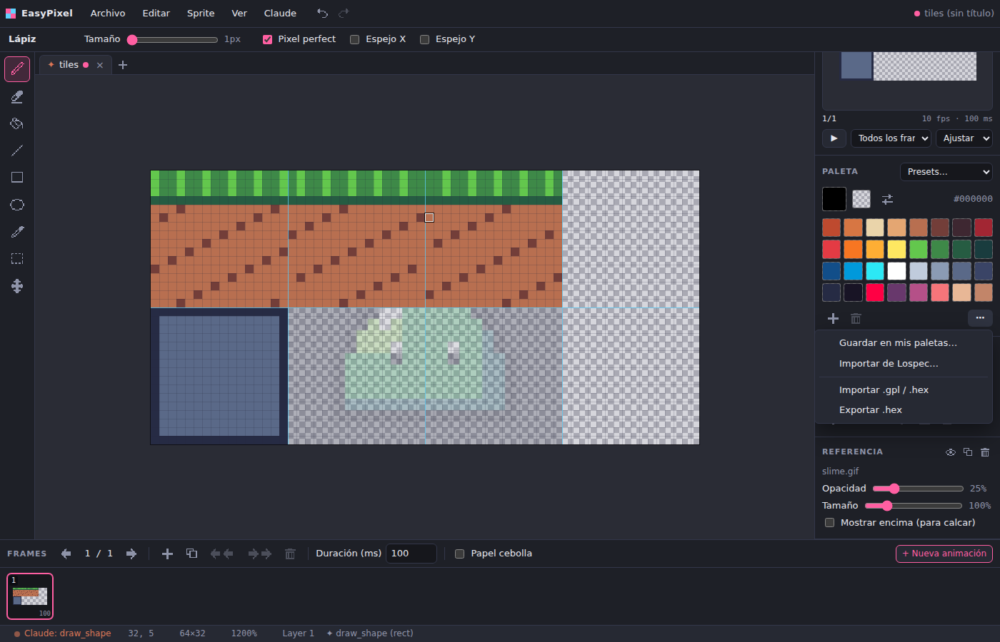

# EasyPixel

A desktop pixel art editor for game sprites and spritesheets, built with **React + TypeScript** on
**Electron**. It ships with an **MCP server so Claude can draw for you**, live, inside the editor,
and it exports straight to **Godot 4** (`SpriteFrames`, `AnimatedSprite2D` scenes and `TileSet`s).



The interface is available in **English and Spanish** (*View → Language*); it follows your system
language on first run. Texts live in [`apps/desktop/src/renderer/src/i18n`](apps/desktop/src/renderer/src/i18n),
so adding a language is one file. Screenshots below show the Spanish UI.

## Download

Grab the installer for your OS from the
[**latest release**](https://github.com/AlvaroFalcon/EasyPixel/releases/latest):

| OS | File | Notes |
|---|---|---|
| Windows | `EasyPixel-x.y.z-win-x64.exe` | NSIS installer. Unsigned: SmartScreen may ask, choose *More info → Run anyway*. |
| macOS | `EasyPixel-x.y.z-mac-universal.dmg` | Intel + Apple Silicon. Unsigned: the first time, right click the app → *Open*. |
| Linux | `.AppImage` or `.deb` | Portable AppImage or Debian/Ubuntu package. |

## Draw with Claude (MCP)



*An MCP client creating a sprite, drawing nine frames with `draw_grid`, naming the `idle` and
`jump` animations and playing them, all live in the editor.*

When EasyPixel starts it runs a local MCP server at `http://127.0.0.1:7777/mcp` (only reachable
from your computer). The **Claude → Conectar con Claude…** menu shows the exact configuration for
your install, with copy buttons.

**Claude Code** (once):

```bash
claude mcp add --transport http easypixel http://127.0.0.1:7777/mcp
```

**Claude Desktop**: add the block shown in that dialog to `claude_desktop_config.json`
(*Settings → Developer → Edit Config*). It uses a tiny stdio bridge that EasyPixel copies to its
data folder (a path that stays valid across updates) and runs with the EasyPixel binary itself, so
you don't need Node.js:

```json
{
  "mcpServers": {
    "easypixel": {
      "command": "<path to EasyPixel>",
      "args": ["<EasyPixel data folder>/mcp-bridge.js"],
      "env": { "ELECTRON_RUN_AS_NODE": "1" }
    }
  }
}
```

Then ask something like: *"In EasyPixel, draw a 32×32 knight with the Endesga 32 palette and a
4-frame idle animation, then export it to my Godot project in ~/games/my_game/sprites/knight"*.

- Everything Claude draws shows up **live**. Each action is one undo step marked with ✦, so you can
  revert it with `Ctrl+Z`.
- Sprites created by Claude open in a **new tab**, so your work is never overwritten.
- The **MCP** indicator in the status bar shows whether the server is running and what Claude is
  doing.
- The port can be changed with the `EASYPIXEL_MCP_PORT` environment variable.

Available tools:

| Group | Tools |
|---|---|
| Sprites | `get_editor_state`, `create_sprite`, `select_sprite`, `save_sprite` |
| Palette | `set_palette`, `replace_color` |
| Drawing | `draw_grid` (a whole frame as text), `draw_pixels`, `draw_shape`, `fill`, `clear`, `transform` |
| Layers | `add_layer`, `update_layer`, `delete_layer` |
| Frames & animations | `add_frame`, `delete_frame`, `set_frame_duration`, `create_animation`, `update_animation`, `delete_animation` |
| Review | `get_frame_image` (upscaled PNG with a pixel grid), `get_spritesheet_image`, `get_frame_grid`, `undo` |
| Godot | `export_godot` (PNG + `SpriteFrames.tres` + `.tscn` scene), `export_godot_tileset` |

The server also exposes a `pixel_art_sprite` prompt (guided workflow) and server instructions with
the conventions (coordinates, grid format) and pixel art tips. `draw_grid` takes one string per row
and one character per pixel (`0-9a-zA-Z` = palette index, `.` = transparent), which is the most
reliable way for a language model to draw.

## Example: animated slime

Made entirely through the MCP tools ([`examples/slime`](examples/slime)): a 24×24 slime with a
4-frame `idle` and a 5-frame `jump`.

<p>
  
</p>


The folder contains the editable project (`slime.epx.json`), the spritesheet, and the Godot
`SpriteFrames` resource and scene, validated in Godot 4.5.1.

## Features

**Editor**
- Canvas with zoom, pan, pixel grid and tile grid (8/16/32).
- Tools: pencil (pixel-perfect mode, brush size), eraser, bucket fill, line, rectangle, ellipse,
  eyedropper, rectangular selection (move, copy/cut/paste) and X/Y mirror drawing.
- Layers (visibility, lock, opacity, reorder, duplicate, merge down) and unlimited undo/redo.
- Palettes: presets (PICO-8, Sweetie 16, Endesga 32, Game Boy, 1-bit), RGBA editing, your own saved
  palettes, `.gpl`/`.hex` import, and **Lospec** import by name or URL.
- Reference image behind the sprite, or on top for tracing, with opacity and size. It is never
  exported.
- Several sprites open at once in tabs.

**Animation**
- Frame timeline with per-frame duration (ms), like Aseprite.
- Named animations (`idle`, `walk`, `run`…) with direction (forward, reverse, ping-pong) and loop,
  shown as colored bars above the frames. Shift+click selects a frame range.
- Onion skin (red = previous, blue = next) and a looping preview with exact timing.

**Import / export**
- PNG import (as a new sprite, slicing spritesheets, or pasted into the current layer).
- PNG export of one frame or a spritesheet grid, and **animated GIF** per animation.
- Own `.epx.json` format: readable JSON (layers, frames, animations, palette, base64 RGBA per cel),
  friendly to git and to Claude.

## Godot 4 export



*File → Exportar a Godot…*: pick a folder inside your project. EasyPixel looks for `project.godot`
in that folder or above it and builds the `res://` paths. It writes:

| File | What for |
|---|---|
| `<name>.png` | Grid spritesheet (columns, spacing and scale are configurable). It also works for a `Sprite2D` with `hframes`/`vframes`. |
| `<name>.tres` | `SpriteFrames` with one `AtlasTexture` per frame and **one animation per EasyPixel animation**. Speed and relative durations come from each frame's ms; loop is kept, and ping-pong/reverse are expanded because Godot only plays forward. Without animations, a `default` one is exported. |
| `<name>.tscn` | A ready-to-instance `AnimatedSprite2D` scene with `texture_filter = Nearest` and `autoplay` (`idle` by default). |

The settings are saved in the `.epx.json`, so after the first export **Ctrl+Shift+E** re-exports
and Godot reimports the changes automatically.

### TileSets



Draw your tiles on a canvas that is a multiple of the tile size (turn on *View → tile grid*) and
choose **TileSet** in the Godot dialog. You get `<name>.png` and `<name>_tileset.tres` with a
`TileSetAtlasSource`, where only non-empty cells become tiles. In Godot, add a `TileMapLayer`,
assign the TileSet and paint.

**Pixel art tips for Godot:** set *Project Settings → Rendering → Textures → Default Texture
Filter* to **Nearest** (the exported scene already forces it on its node) and use
*Display → Window → Stretch* in `viewport` or `canvas_items` mode with integer scaling.

Every export format is validated against a real Godot 4.5.1 in CI: the resources are imported
headless, loaded, and the TileSet is used to paint a `TileMapLayer`.

## Keyboard shortcuts

| Key | Action | Key | Action |
|---|---|---|---|
| `B` | Pencil | `X` | Swap colors |
| `E` | Eraser | `[` / `]` | Brush size |
| `G` | Bucket fill | `,` / `.` | Previous / next frame |
| `L` | Line (`Shift` = 45°) | `+` / `-` / `0` | Zoom / fit |
| `U` | Rectangle (`Shift` = square) | `Space` + drag | Pan |
| `O` | Ellipse (`Shift` = circle) | `Alt` + click | Quick eyedropper |
| `I` | Eyedropper | `Ctrl+Z` / `Ctrl+Y` | Undo / redo |
| `M` | Selection | `Ctrl+C/X/V` | Copy / cut / paste |
| `H` | Hand | `Delete` | Clear selection |
| `P` | Play / pause animation | `Enter` / `Esc` | Commit / cancel floating selection |
| `Ctrl+S` | Save | `Ctrl+G` | Pixel grid |
| `Ctrl+O` | Open | `Shift` + click a frame | Select a frame range |
| `Ctrl+I` | Import PNG | `Ctrl+E` | Export PNG / GIF |
| `Ctrl+Shift+E` | Re-export to Godot | | |

Left click draws with the primary color and right click with the secondary one. The secondary
color is transparent by default, so right click erases.

## Development

Requirements: Node.js 20+ (tested with Node 22) and npm 10+.

```bash
npm install          # installs dependencies (downloads Electron)
npm run dev          # desktop app with hot reload
npm run dev:web      # the UI alone in a browser: http://localhost:5173
npm run build        # builds main, preload, renderer and the MCP bridge into apps/desktop/out
npm run dist -w @easypixel/desktop   # installer for your OS in apps/desktop/release/
```

Quality checks (all of them run in CI):

```bash
npm test               # unit tests (Vitest)
npm run typecheck      # strict TypeScript in every package
npm run test:e2e       # UI tests in a browser (Playwright)
npm run test:electron  # real Electron app + MCP clients (HTTP and stdio) + Godot exports
                       # (set GODOT_BIN=/path/to/godot to validate with a real Godot 4)
```

Releases: run *Actions → Release → Run workflow* with a version such as `v0.2.0`, or push a `v*`
tag. Installers for Windows, macOS and Linux are built and published to GitHub Releases.

### Project layout

```
packages/core        Pure TypeScript logic (no DOM): document model, drawing, layers, frames,
                     palettes, compositing, spritesheets, GIF encoder, Godot export,
                     .epx.json format, undo history, agent helpers (text grids)
apps/desktop
  src/main           Electron main process: window, file dialogs, MCP server (HTTP)
  src/bridge         stdio ⇄ HTTP bridge for Claude Desktop
  src/preload        Safe window.easypixel bridge (contextIsolation + sandbox)
  src/renderer       React UI (Zustand store, Canvas 2D), MCP tool executor
e2e                  Browser UI tests (Playwright)
e2e-electron         Electron + MCP + Godot integration tests
examples             Sample sprites made with EasyPixel
```

Documents are **immutable**: every edit creates a new document that shares unchanged data with the
previous one. That makes undo/redo trivial and works the same for edits made by Claude, since the
history records who made each change.

See [`docs/PLAN.md`](docs/PLAN.md) for the original plan and phases (in Spanish).

## License

[MIT](LICENSE) © 2026 Alvaro Falcon. You are free to use, modify and distribute EasyPixel, including
commercially, as long as the copyright and license notice are kept.
